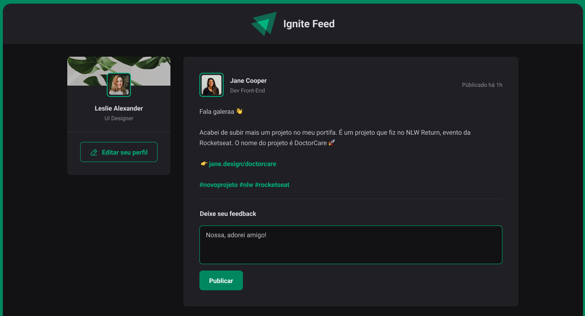

## Ignite Feed | Visualização

<h1 align="center">
    
</h1>

## 💻 Projeto

O Ignite Feed foi um projeto realizado com o objetivo de colocar em prática fundamentos sobre componentes e propriedades no React. Ele consiste em um feed de postagens no qual as pessoas podem adicionar ou remover comentários. Além disso, é possível interagir com os comentários, clicando no botão "Aplaudir". 

## 🧬 Tecnologias
Este projeto foi desenvolvido utilizando as seguintes tecnologias:
* [React (base do projeto)](https://pt-br.reactjs.org/)
* [Typescript](https://www.typescriptlang.org/)
* [CSS Modules](https://vitejs.dev/guide/features.html#css-modules)
* [Phosphor Icons)](https://phosphoricons.com/)
* [Media Queries](https://developer.mozilla.org/pt-BR/docs/Web/CSS/Media_Queries/Using_media_queries)
* [Date-fns](https://date-fns.org/)

## 📖 Conhecimento
Com o Ignite Feed, aprendi a utilizar: 
* `Vite` para iniciar o projeto;
* `Typescript` para adicionar tipagens;
* `CSS Modules` para que o CSS seja específico de cada componente;  
* `Phosphor Icons` para adicionar ícones;
* `Media Queries` para aplicar responsividade; 
* `Date-fns` para manipular as datas;

## Utilização do projeto

### 💾 Baixar o projeto
Faça o clone do repositório para ter uma versão do projeto em sua máquina: 
`$ git clone https://github.com/mmanaclara/ignite-feed.git`

### 🧰 Instalar dependências
`$ npm install ou yarn`  

### 🚀 Iniciar o projeto
`$ npm start ou yarn start`

## 📝 Licença
Este projeto está licenciado nos termos da licença [MIT](https://github.com/mmanaclara/ignite-feed/blob/main/LICENSE). 

<a href="#topo">⬆</a>

